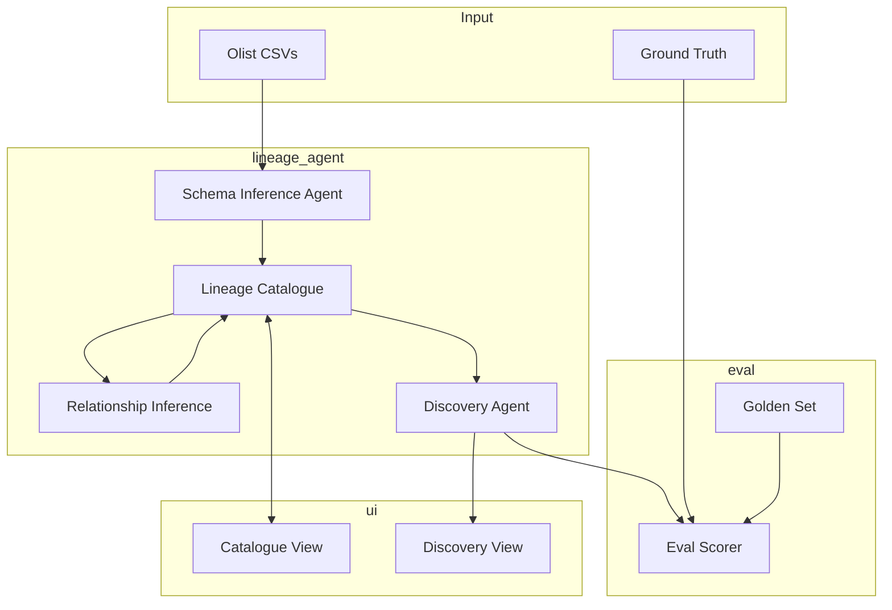
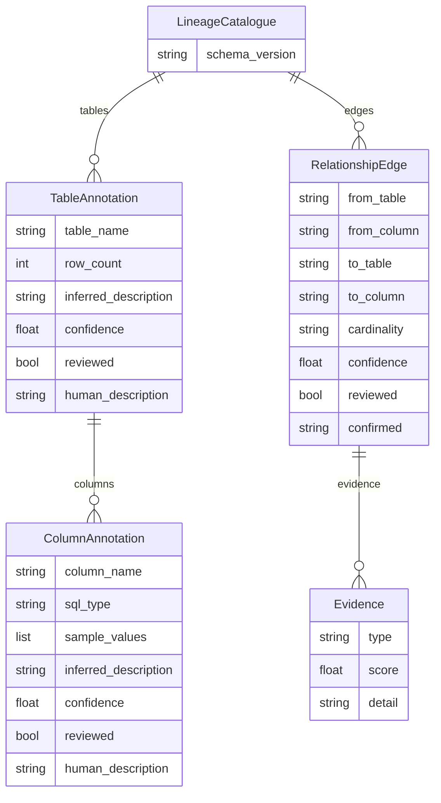
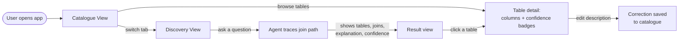

# Product Design

## Competitor Analysis

| Tool | Does well | Falls short |
|---|---|---|
| **Atlan** | Active metadata, AI-assisted descriptions, lineage visualization | Lineage relies on parsing query history — needs it to exist |
| **Select Star** | Automated column-level lineage, popularity-based discovery | Same — depends on existing query/BI tool history |
| **Castor** | Strong documentation-generation UX, business glossary | Augments existing metadata rather than inferring cold-start |
| **OpenMetadata** | Open-source, ingestion connectors, AI description features | Lineage mostly declared via connectors reading existing FK/query info |
| **dbt docs** | Excellent lineage *if* models are written in dbt | Only works if transformations already defined in dbt |

**The gap:** every competitor requires *some* existing metadata or query history to bootstrap lineage. None solve the cold-start case — a lake with zero documentation and zero query history, where lineage must be inferred purely from schema + sample data.

---

## Architecture

The **lineage catalogue** is the single source of truth — every component reads from and writes to it.

---

## Data Model

Every annotation type (table, column, edge) carries the same pattern: an AI-inferred value + confidence, plus a separate field for human corrections — so disagreement is never overwritten, only added.

---

## UI Flow (Phase 5 — in progress)

**Catalogue View**
- Browse all tables; each shows its inferred description and a confidence badge (high / medium / low)
- Click into a table to see column-level descriptions, sample values, and confidence
- Edit/accept inferred descriptions — corrections are stored separately from the original AI guess

**Discovery View**
- Ask a natural-language question (e.g. the 5 golden-set questions)
- Agent returns the required tables, the join path (with columns), and a plain-English explanation of how to get there
- Each table in the result links back to its Catalogue entry for more context
